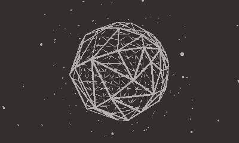

# Sphere
## A small sketch ported to the PlayDate

A [PlayDate] version of my [Sphere]. Might still be prone to slight changes.

## Technical differences
- Sphere data restructured to only contains unique edge data (less data moved around)
- No sorting needed to render the sphere.
- Sphere edge/star thickness based on position
- No UI (yet?)
- 1-bit graphics (because 1-bit screen).

## Additional Notes
- `sphere.c` contains the wireframe data for the sphere (vertices + edges)
- `mat_math.c` contains pure C for OpenGL-ish vec3/vec4/mat3/mat4 types and operations.
    - The matrices are in column order, like OpenGL.
    - The projection is based on a right-hand OpenGL basis (Y+ upwards, Z+ towards the camera).
    - Not everything was tested but given that most of the code has been written as needed, it should work more or less pretty well.
    - Inspiration : OpenGL, GLM.

Thanks to [Heiko Behrens] for testing the project on a real device and providing me timing info so I could fit the sketch under the targeted 30FPS budget.

[PlayDate]: https://play.date
[Sphere]: https://www.lexaloffle.com/bbs/?tid=30467
[Heiko Behrens]: https://twitter.com/HBehrens